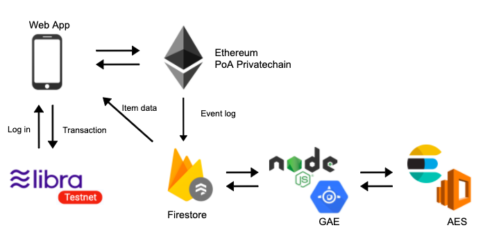

# FLibra (Libra x Flea market)


## Demo website
https://flibra.gaiax-blockchain.com/


## Document
https://medium.com/@gnx.vw903/flea-market-using-libra-and-ethereum-c063e5e5723c


##  FLibra architect



## Developer's guide

You have 5 steps to build application.
1. Build blockchain and node
2. Deploy contract
3. Set up firestore
4. Set up elasticsearch
5. Set up frontend

##  Install 

```
git clone git@github.com:gaiax/fLibra.git
cd fLibra
```

## 1. Build blockchain and node

### Set up Geth

Install ethereum
```
brew tap ethereum/ethereum
brew install ethereum
```

### Create account

Make `flibrachain` directory, and create a geth account for development.

```
$ mkdir flibrachain
$ geth account new --datadir ./flibrachain/node1
```

```
INFO [12-20|11:37:00.688] Maximum peer count                       ETH=25 LES=0 total=25
Your new account is locked with a password. Please give a password. Do not forget this password.
Passphrase:
Repeat passphrase:
Address: {57da1c524a3e762a8921983f52d3ce21672357f7}
```

### Generate the genecis block

```
$ cd flibrachain
$ puppeth
```

Set a network name. In this case, I named "flibrachain"
```
Please specify a network name to administer (no spaces, hyphens or capital letters please)
>flibrachain
```

Type "2" to generate new genecis block. 
```
What would you like to do? (default = stats)
 1. Show network stats
 2. Configure new genesis
 3. Track new remote server
 4. Deploy network components
> 2
```

Type "1".
```
What would you like to do? (default = create)
 1. Create new genesis from scratch
 2. Import already existing genesis
> 1
```

Type "2" to choose PoA consensus algorithm.
```
Which consensus engine to use? (default = clique)
1. Ethash - proof-of-work
2. Clique - proof-of-authority
> 2
```

```
How many seconds should blocks take? (default = 15)
> 5
```

Type the address that you created before, and press enter twice.
```
Which accounts are allowed to seal? (mandatory at least one)
> 0x4d8c003c1dc28a28a323873752e2b07c2cf3d413
> 0x
```

Again
```
Which accounts should be pre-funded? (advisable at least one)
> 0x4d8c003c1dc28a28a323873752e2b07c2cf3d413
> 0x
```

```
Should the precompile-addresses (0x1 .. 0xff) be pre-funded with 1 wei? (advisable yes)
> yes
```

Type network id. 
```
Specify your chain/network ID if you want an explicit one (default = random)
>1515
```

Next, type "2" to manage genecis block.
```
What would you like to do? (default = stats)
1. Show network stats
2. Manage existing genesis
3. Track new remote server
4. Deploy network components
> 2
```

Then, export information of genesis block
```
 1. Modify existing fork rules
 2. Export genesis configurations
 3. Remove genesis configuration
> 2
```

If you don't mind where those will be save, press enter.
```
Which folder to save the genesis specs into? (default = current)
  Will create flibrachain/.json, flibrachain/-aleth.json, flibrachain/-harmony.json, flibrachain/-parity.json
>
```

```
IINFO [12-20|22:54:03.661] Saved native genesis chain spec          path=privateconsortium.json
ERROR[12-20|22:54:03.662] Failed to create Aleth chain spec        err="unsupported consensus engine"
ERROR[12-20|22:54:03.662] Failed to create Parity chain spec       err="unsupported consensus engine"
INFO [12-20|22:54:03.663] Saved genesis chain spec                 client=harmony path=privateconsortium-harmony.json
```

### Start a network

Initialize a node.

```
$ cd flibrachain
$ geth --datadir node1 init flibrachain.json
```

Start up geth

```
geth --datadir node1/ --syncmode 'full' --port 30311 --rpc --rpcaddr '0.0.0.0' --rpcport 8545 --rpccorsdomain "*" --rpcvhosts "*" --rpcapi 'personal,db,eth,net,web3,txpool,miner' --ws --wsapi 'eth,web3,net' --wsorigins='*' --wsaddr='0.0.0.0' --wsport 8546 --networkid 1515 --gasprice '0'
```

In another tab, start mining to build blockchain

```
$ cd flibrachain
$ geth attach ipc:node1/geth.ipc
Welcome to the Geth JavaScript console!
```

Unlock your account
```
> personal.unlockAccount(eth.coinbase,"Password",0)
true
```

Set default account
```
> eth.defaultAccount = eth.coinbase
0x4d8c003c1dc28a28a323873752e2b07c2cf3d413
```

Start mining
```
> miner.start()
null
```

You can see how many blocks blockchain has like this.
```
eth.blockNumber
```

### Start blockchain
```
cd flibrachain
geth --datadir node1/ --syncmode 'full' --port 30311 --rpc --rpcaddr '0.0.0.0' --rpcport 8545 --rpccorsdomain "*" --rpcvhosts "*" --rpcapi 'personal,db,eth,net,web3,txpool,miner' --ws --wsapi 'eth,web3,net' --wsorigins='*' --wsaddr='0.0.0.0' --wsport 8546 --networkid 1515 --gasprice '0'
```

### Start mining
```
geth attach ipc:node1/geth.ipc
> personal.unlockAccount(eth.coinbase,"Sample",0)
> miner.start()
```

Block gas limit is guradually increase, so you may have to wait until block gas limit reaaches at `8000000` 

If you want to create new private blockchain, you can check this. 
https://github.com/gaiax/fLibra/tree/master/flibrachain 

## 2. Deploy contract

Move on truffle directory and install dependencies.
```
cd truffle
npm i
```

### Config
```
MNEMONIC = "receive risk draw record wheel ... benefit broccoli cruel net present topic"
truffleEndpoint = http://0.0.0.0:8545
```
Please use your mnemonic phrase.

### Deploy contract 
```
$ truffle console --network local
truffle(local)> migrate --reset
```
If you successfully deployed contract, you can find JSON file in "../frontend/abis/"

## 3. Set up firestore
Please create a project on Firebase.
https://firebase.google.com/docs/firestore/quickstart

Connect your repository with firebase project
```
npm install -g firebase-tools 
// or
yarn add firebase-tools
firebase login
firebase init
```

## 4. Set up elasticsearch

If you already installed elasticsearch, you can skip this step.

### Install elasticsearch and Kuromoji for Japanese search
Install elasticsearch 
https://www.elastic.co/guide/en/elasticsearch/reference/7.4/brew.html

Install kuromoji
https://www.elastic.co/guide/en/elasticsearch/plugins/current/analysis-kuromoji.html


### Add index and start up elasticsearch in local
```
cd /usr/local/var/homebrew/linked/elasticsearch-full //please find your path
curl -XPUT 'localhost:9200/flibra?pretty'
bin/elasticsearch
```

### Start node to connect firastore and elasticsearch

config
```.env
ES_HOST = localhost:9200
apiKey = AIzaSyAIqQE55...i0UrqM-miX-k
authDomain = flibra...-80092.firebaseapp.com
databaseURL = https://flibra....firebaseio.com
projectId = flibra...-80092
storageBucket = gs://flibra...-80092.appspot.com
messagingSenderId = 2472...9401
appId = 1:247244459401:web:af0d3f277789fdfcfe2558
```

```
cd Elasticsearch
npm i
node app.js
```

## 5. Set up frontend
```
cd frontend 
```

### Config

Plase set your firebase project key in config.
```.env
libraMnemonic = "birth easily sword divert scale main physical dune menu exist marriage trophy true quick nerve clown equal short assist taste flame grant vintage erase"
apiKey = AIzaSyAIqQE55...i0UrqM-miX-k
authDomain = flibra...-80092.firebaseapp.com
databaseURL = https://flibra....firebaseio.com
projectId = flibra...-80092
storageBucket = gs://flibra...-80092.appspot.com
messagingSenderId = 2472...9401
appId = 1:247244459401:web:af0d3f277789fdfcfe2558
web3Endpoint = http://0.0.0.0:8545
URL = http://localhost:3000
```

```
npm i 
npm run dev
```

## Contributing

Pull requests and stars are always welcome.

1. Fork it!
2. Create your feature branch: git checkout -b my-new-feature
3. Commit your changes: git commit -am 'Add some feature'
4. Push to the branch: git push origin my-new-feature
5. Submit a pull request :D

